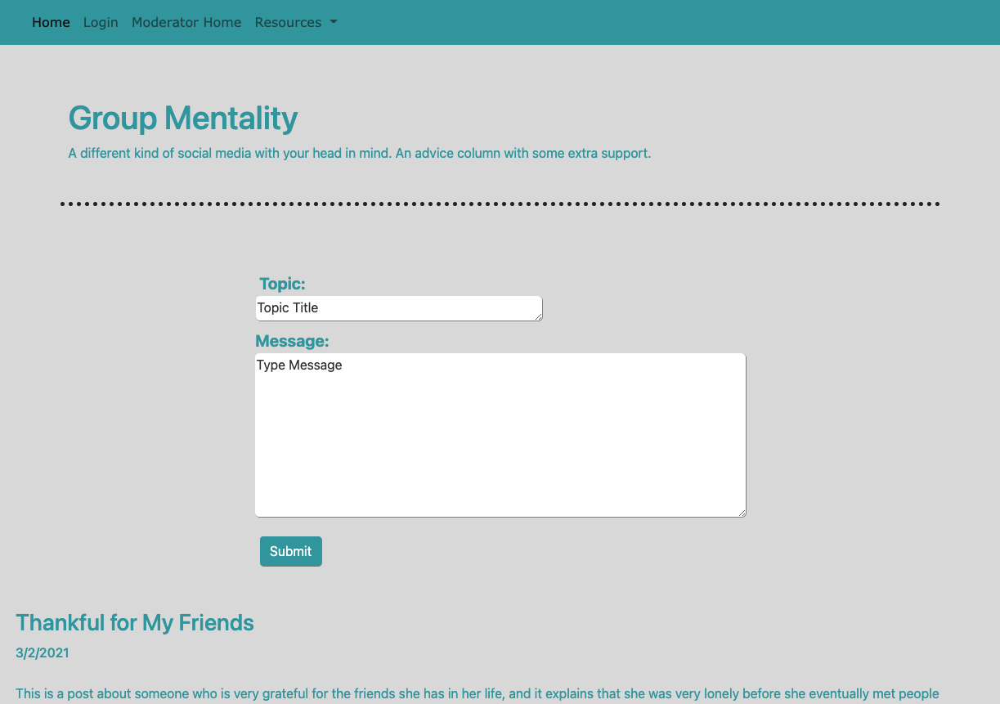

# Group Mentality

[Click here to visit the site](https://protected-waters-68869.herokuapp.com/)

---
### Table of Contents
- [Descritption](#description)
- [Technologies](#technologies)
- [Author Info](#author-info)
- [License](#license) 

---
## Description
Group Mentality is a full-stack forum application centered around promoting mental health. Users are able to read anonymous interactions between other users and mental health experts, and they are able to send in their own questions and experiences to receive advice from mental health experts. These experts (i.e. moderators) are able to see a list of pending user questions, edit and respond to them, or delete them if a similar interaction has already taken place on the site. 

### Future Development
In the future, Group Mentality will allow for a richer interactive experience between users and mental health experts (like notifications, the ability for moderators to tell users why their post has been rejected, etc.), and we'd like to provide users and moderators the ability to comment on forum posts. In the future, we'd also like to exchange the browser alerts for modals.

## Technologies
- HTML
- CSS
- JavaScript
- Bootstrap
- Heroku
- MySQL
- Sequelize
- Insomnia
- GreenSock Animation Platform (GSAP)
- Express
- Node
  
[Back to Top](#group-mentality)

---
## Author Info
- Ian Everitt - [https://github.com/rflctvEQ](https://ca.slack-edge.com/T01J4FQGGA2-U01JUQ76EHX-5c806fa4573c-512)
- Ellissa Issa - [https://github.com/ellisaissa](https://ca.slack-edge.com/T01J4FQGGA2-U01JFVCQ8AE-0038471999ad-512)
- Erick Michaelson - [https://github.com/erickmichaelson](https://ca.slack-edge.com/T01J4FQGGA2-U01J1C23CF9-24b07fccebf6-512)
- Jamie Rippee - [https://github.com/jamtrip7](https://ca.slack-edge.com/T01J4FQGGA2-U01KM5DLZH6-1546fc156004-512)
  
[Back to Top](#group-mentality)

---

## License ####
This is free and unencumbered software released into the public domain.
Anyone is free to copy, modify, publish, use, compile, sell, or
distribute this software, either in source code form or as a compiled
binary, for any purpose, commercial or non-commercial, and by any
means.
In jurisdictions that recognize copyright laws, the author or authors
of this software dedicate any and all copyright interest in the
software to the public domain. We make this dedication for the benefit
of the public at large and to the detriment of our heirs and
successors. We intend this dedication to be an overt act of
relinquishment in perpetuity of all present and future rights to this
software under copyright law.
THE SOFTWARE IS PROVIDED "AS IS", WITHOUT WARRANTY OF ANY KIND,
EXPRESS OR IMPLIED, INCLUDING BUT NOT LIMITED TO THE WARRANTIES OF
MERCHANTABILITY, FITNESS FOR A PARTICULAR PURPOSE AND NONINFRINGEMENT.
IN NO EVENT SHALL THE AUTHORS BE LIABLE FOR ANY CLAIM, DAMAGES OR
OTHER LIABILITY, WHETHER IN AN ACTION OF CONTRACT, TORT OR OTHERWISE,
ARISING FROM, OUT OF OR IN CONNECTION WITH THE SOFTWARE OR THE USE OR
OTHER DEALINGS IN THE SOFTWARE.
For more information, please refer to <https://unlicense.org>
   
[Back to Top](#group-mentality)
